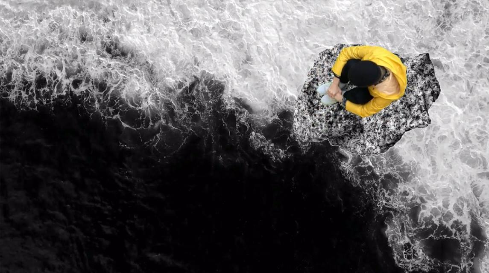
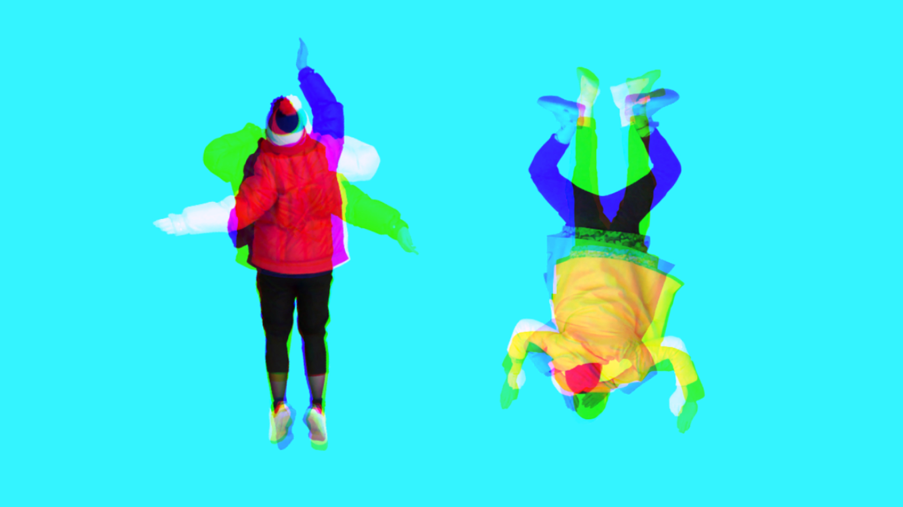

# projectideas
C-tech 2nd semester final projects

## CC2
### Virtual cookies
As my CC1 Christmas card, I made a virtual cookie, that you can eat by clicking. 
https://editor.p5js.org/eperjesirit@gmail.com/full/u7MrXMKRf
What I initially wanted to do is to use face-tracking, so the cookie can be eaten with opening and closing one's mouth, and with positioning one's head.
Why?
My mother and my grandmother express their love by feeding us. They love us very much, so they expect us to eat a lot. I created an edible virtual cookie to express my love without making other people fat.
#### Plan:
1. draw white background.
2. load food image.
3. implement Facetracker to track one's face using FaceOSC. 
https://github.com/kylemcdonald/ofxFaceTracker
https://github.com/kylemcdonald/ofxFaceTracker/releases
4. define what is open mouth, what is close mouth. 
open mouth > set white circle's size and position
closed mouth > draw 1 circle with above parameters over food image.

EXTRAS:
- choosing food option
- bites are not circles, but more precise random shapes.
- make it sendable to people somehow. :S 

### Stone people, fluid people
I have this theory about personalities, stone people are quite stable and are sure about their place in the world, and not too easygoing, fluid people are adapting and flowing around these rocks. 
I had a VJ performance about it, for which I made gifs about my friends swimming and sitting, which I really like, but they only exist in my VJ software and in some images.

I'm thinking about using these gifs, and creating a little game/simulation of this. 

#### Plan:
1. draw background.
2. import my gifs/videos.
3. if mouse click + S > create a stone-person at mouse coordinates, who stays there. 
    I also want to create a little computer generated mountain under the person made from basic shapes.
4. if mouse click + F > create a swimming person at mouse coordinates, who starts swimming in a random(?) direction.
    I want to make some waves, or tracing the movement of the swimming people. maybe with sinewaves?

I'm not a hundred person sure how this would look like, I might come up with other interaction ideas, so this concept has more space to improve.

## 2nd semester closing project
### the Harry Potter book
Moving images are nice, because it seems like those moments captured are still alive.
A few years ago I wanted to make a collection of gifs with my nice memories with ex-boyfriends, and put them in the shape of a real book. Luckily I'm not invested anymore in thinking too much about the past, but I'm still excited about turning the pages of a real empty book, which comes alive. This can give a shape for several projects in the future, for example our previous VJ project, when we have been sending each other 1 video and an instruction with other artists, like a letter chain, or to collaborations between a video artist and a writer. Or the Big Book project, that is forming now with my friend, which is based on the Hungarian saying: as it is written in the big book, which means you are doing your life the "proper" way: studying, working, getting married, having kids. These things meanwhile got more complicated, the old normal is not necessarily the new normal, but we are measuring ourselves according to the old norms. For this, an interactive new real life book would be deifinitely a nice take-on.
#### Plan:
1. Take an empty real life book.
2. write the page numbers in it with infrared pen. So a webcam/kinect (?) can see it, humans can't. 
https://maxmax.com/shopper/product/cid-15272
3. Set up a webcam/kinect to see which page is open. 
4. Openframeworks (?) - computer vision? teaching with machine learning? decide which sign it is > load the corresponding page/video 
I can imagine that numbers are not the easiestly understandable for a computer. 
Or is it easier in P5?
5. map the projection on the book nicely. (I have a small and cute projector)
6. Create content for the book.

EXTRA:
It would be also nice, if the book has some real life printed pages mixing with the projections. At the same time, if it is completely empty, it can be reused for different contents. 
An other direction is to go is to make the book really interactive, not only made for reading.
Maybe it is not neccessary to have the pages numbered in infrared world, but just normally. 

## PGS
clouds.

